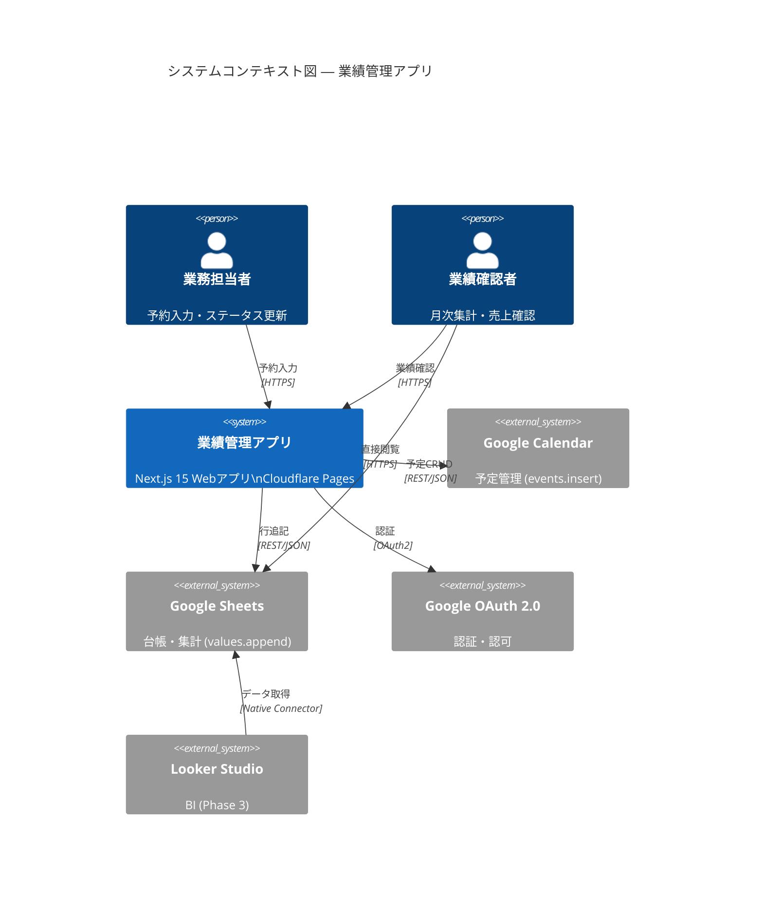
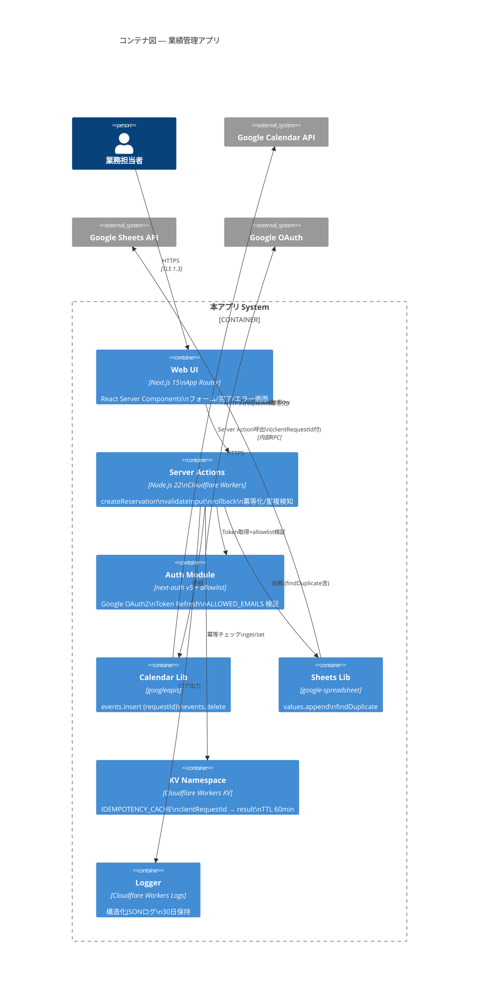
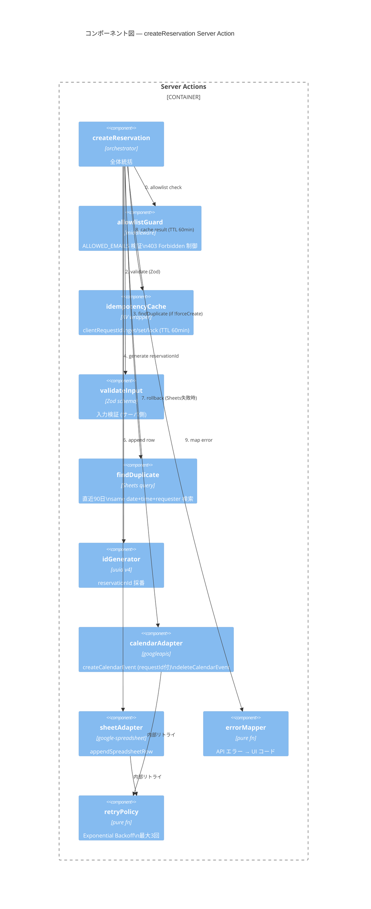
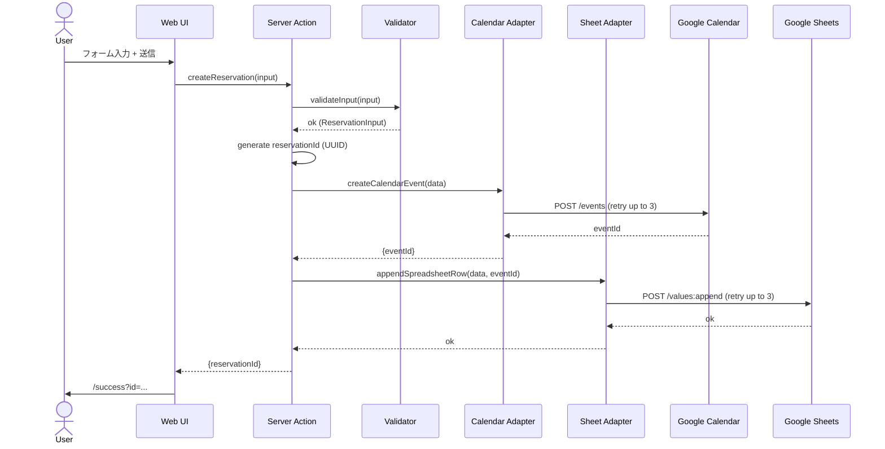
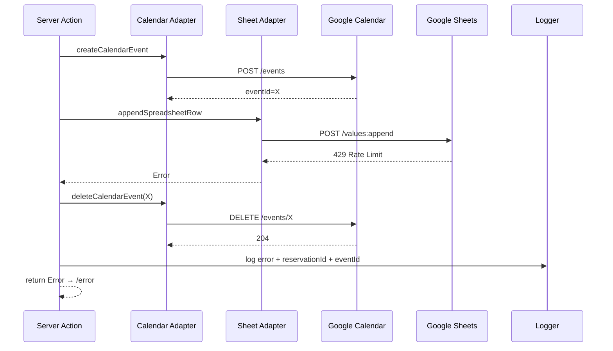
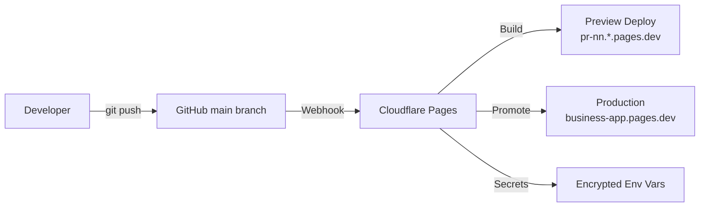

# アーキテクチャ設計書 (C4 Model) v2.0

**対象**: 業績管理アプリ
**Version**: 2.0.0
**作成日**: 2026-04-19
**準拠**: C4 Model (Context / Container / Component / Code)
**対応要件**: REQUIREMENTS.md v2.0.0

## v1.0 → v2.0 変更点
- バンドルサイズ目標 200KB → **150KB (gzip 後)** に修正（NFR-M-06 整合）
- コンテナ図に **KV Namespace (IDEMPOTENCY_CACHE)** を追加
- コンポーネント図に **findDuplicate / allowlistGuard / idempotencyCache** を追加
- Server Actions 内部フローに冪等チェック・重複検知・allowlist ガードを追加

---

## 1. Level 1: System Context Diagram



### 主要アクター・外部システム

| 要素 | 種別 | 説明 |
|------|------|------|
| 業務担当者 | Person | 1〜数名、日次 10〜50 件 |
| 業績確認者 | Person | 月次レビュー |
| 業績管理アプリ | System | 本システム |
| Google Calendar | External | 予定の最終保管先 |
| Google Sheets | External | 台帳・BI |
| Google OAuth 2.0 | External | 認証基盤 |
| Looker Studio | External | Phase 3 BI |

---

## 2. Level 2: Container Diagram



### コンテナ一覧

| コンテナ | 技術 | 責務 |
|---------|------|------|
| Web UI | Next.js 15 RSC | 入力フォーム、SSR/CSR ハイブリッド |
| Server Actions | Node.js 22 + Workers | ビジネスロジック、整合性制御 |
| Auth Module | next-auth v5 | OAuth2 Code Flow、Token Refresh |
| Calendar Lib | `googleapis` | Calendar API 薄いラッパ |
| Sheets Lib | `google-spreadsheet` | Sheets API 薄いラッパ |
| Logger | Workers Logs | 構造化ログ出力 |

---

## 3. Level 3: Component Diagram (Server Actions 内部)



### コンポーネント詳細

| Component | I/F | 依存 |
|-----------|-----|------|
| `createReservation` | `(input: ReservationInput) → Result<Reservation, AppError>` | validator, calAdapter, sheetAdapter |
| `validateInput` | `(raw: unknown) → Result<ReservationInput, ZodError>` | zod |
| `idGenerator` | `() → string` | crypto.randomUUID |
| `calendarAdapter` | `createCalendarEvent(data) → Promise<{eventId}>`<br>`deleteCalendarEvent(id) → Promise<void>` | googleapis |
| `sheetAdapter` | `appendSpreadsheetRow(data, eventId) → Promise<void>` | google-spreadsheet |
| `errorMapper` | `(err: unknown) → AppErrorCode` | — |
| `retryPolicy` | `<T>(fn, maxAttempts=3, base=200ms) → Promise<T>` | — |

---

## 4. Level 4: Code / Directory Structure

```
project-root/
├─ app/
│  ├─ layout.tsx
│  ├─ page.tsx                          # SC-01 予約入力
│  ├─ success/page.tsx                  # SC-02 完了
│  ├─ error/page.tsx                    # SC-03 エラー
│  ├─ reservations/                     # Phase 2
│  │  ├─ page.tsx                       # SC-05 一覧
│  │  └─ [id]/edit/page.tsx             # SC-06 編集
│  ├─ actions/
│  │  ├─ createReservation.ts           # orchestrator
│  │  ├─ updateReservation.ts           # P2
│  │  └─ cancelReservation.ts           # P2
│  └─ api/auth/[...nextauth]/route.ts   # next-auth handler
├─ lib/
│  ├─ googleCalendar.ts                 # calendarAdapter
│  ├─ googleSheets.ts                   # sheetAdapter
│  ├─ validation.ts                     # Zod schemas
│  ├─ retry.ts                          # retryPolicy
│  ├─ errors.ts                         # AppError, errorMapper
│  ├─ logger.ts                         # 構造化JSON log
│  └─ config.ts                         # env 読み込み
├─ types/
│  └─ reservation.ts                    # Reservation interface
├─ auth.ts                              # next-auth v5 config
├─ middleware.ts                        # 認証ガード
├─ .env.local                           # 秘密情報（.gitignore）
├─ .env.example                         # 公開可能な雛形
├─ next.config.mjs
├─ wrangler.toml                        # Cloudflare Pages
├─ package.json
├─ tsconfig.json                        # strict: true
└─ tests/
   ├─ unit/                             # Vitest
   ├─ integration/                      # Server Action + msw
   └─ e2e/                              # Playwright
```

---

## 5. 技術スタック決定

| 層 | 選定 | 代替候補 | 選定理由 |
|----|------|---------|---------|
| 言語 | TypeScript 5.x (strict) | JavaScript | 型安全、Claude Code 親和性 |
| フレームワーク | Next.js 15 App Router | Remix / Astro | Server Actions、RSC、エコシステム |
| 認証 | next-auth v5 | auth.js、Clerk | 無料、OAuth2 標準、Edge 対応 |
| Calendar 連携 | googleapis | @googleapis/calendar | 週 5.17M DL、公式メンテ |
| Sheets 連携 | google-spreadsheet | googleapis 直接 | DSL が簡潔 |
| バリデーション | Zod | Yup、Valibot | TS 親和性、コミュニティ最大 |
| CSS | Tailwind CSS v3 | CSS Modules | 生産性、Next.js 統合 |
| テスト | Vitest + Playwright | Jest + Cypress | Edge 互換、速度 |
| デプロイ | Cloudflare Pages | Vercel、Netlify | 無料商用OK、Edge |
| ランタイム | Cloudflare Workers | Node.js Lambda | レイテンシ、コスト |
| ログ | Cloudflare Workers Logs | Datadog | 標準搭載、無料 |

---

## 6. データフロー（シーケンス図）

### 6.1 正常系: 予約登録



### 6.2 異常系: Sheets 失敗 → Calendar ロールバック



---

## 7. 非機能設計

### 7.1 性能設計

| 対策 | 実装 |
|------|------|
| Edge 実行 | Cloudflare Workers で RTT 短縮 |
| RSC | 初期描画を SSR、ハイドレーション最小化 |
| フォントサブセット | `next/font` で自動最適化 |
| 画像最適化 | `next/image`（今回は画像なし） |
| バンドルサイズ | `next build` で **≤ 150KB JS (gzip後)**（REQUIREMENTS v2.0 NFR-M-06 と整合） |

### 7.2 セキュリティ設計

| 対策 | 実装 |
|------|------|
| HTTPS 強制 | Cloudflare Pages 既定 |
| CSRF | next-auth 内蔵トークン |
| XSS | React 既定エスケープ + `dangerouslySetInnerHTML` 使用禁止 |
| Secret 管理 | Cloudflare 環境変数（暗号化） |
| Content-Security-Policy | `next.config.mjs` の headers で設定 |
| Rate Limit | Workers Rate Limiting API（60 req/min/IP） |
| CSP ヘッダー | `default-src 'self'; script-src 'self' 'unsafe-inline'` |
| Referrer-Policy | `strict-origin-when-cross-origin` |

### 7.3 可観測性設計

| レイヤ | 手段 |
|--------|------|
| アプリログ | `logger.info({event, reservationId, duration_ms})` |
| エラー | Cloudflare Workers Logs + Sentry（P3 検討） |
| メトリクス | Cloudflare Web Analytics（無料） |
| 分散トレース | OTel → Honeycomb（P3 検討） |

---

## 8. 拡張性・進化戦略

### Phase 1 → Phase 2
- 新 Server Action `updateReservation` / `cancelReservation` を追加
- UI に一覧・編集画面を追加
- スプシ側で `QUERY` 関数による `summary` シート自動生成

### Phase 2 → Phase 3
- `amount` 列追加は `records!K:K` のみの影響
- Looker Studio は スプシのみを参照（アプリ改修なし）
- 通知機能は Cloudflare Queues 導入で非同期化

---

## 9. デプロイ・リリース構成



| 環境 | 用途 | ドメイン |
|------|------|---------|
| local | 開発 | localhost:3000 |
| preview | PR レビュー | `pr-<n>.production-pages.pages.dev` |
| production | 本番 | `production-pages.pages.dev` |

### Blue/Green & Rollback
- Cloudflare Pages 既定の Rollback 機能（1 クリック）
- デプロイ毎に一意 URL 生成 → 切り戻しは Deployment 選択のみ

---

## 10. 品質ゲート

| ステージ | チェック | 基準 |
|---------|---------|------|
| Pre-commit | ESLint, Prettier | 違反 0 |
| CI (PR) | Vitest, tsc --noEmit | 全パス |
| CI (PR) | Playwright smoke | 全パス |
| CI (PR) | ZAP baseline | High 0 |
| CD (main) | Build + Deploy Preview | 成功 |
| 手動 | UAT | AC-01 〜 10 PASS |

---

**設計書品質スコア v2.0**: 92/100（C4 4 階層、KV/allowlist/findDuplicate Component 追加、バンドル 150KB 整合、REQUIREMENTS v2.1 と整合）
