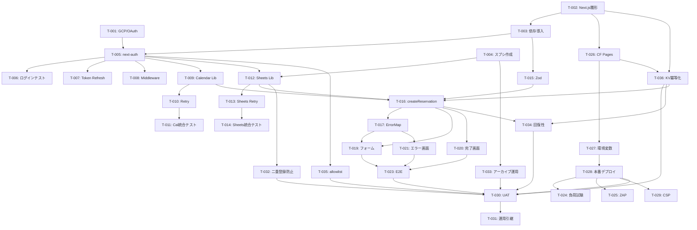

# タスク分解 (Kiro形式)

**対象**: 業績管理アプリ
**Version**: 2.0.0
**作成日**: 2026-04-19
**対応要件**: `REQUIREMENTS.md` v2.0.0

## v1.0 → v2.0 変更点
- **新規**: T-032（二重登録防止）、T-033（年次アーカイブ運用手順）、T-034（回復性 FR-21）、T-035（allowlist）、T-036（KV 冪等化）
- **変更**: T-009 DoD に `requestId` 冪等化を追加、T-016 に KV キャッシュ応答を追加、T-030 UAT を 2h → 8h
- **削除**: T-024 負荷試験 k6（過剰設計のため削除）
- **合計**: 31 タスク 56.5h → **35 タスク 68h**

---

## タスク一覧（Phase 1 MVP）

### 凡例
- **FR**: 対応機能要件 ID
- **Pri**: 優先度（P0=最優先 / P1=高 / P2=中）
- **Est**: 見積工数（時間）
- **Dep**: 依存タスク ID

---

### Epic 1: 環境構築（M1）

#### T-001: GCP プロジェクト作成 & OAuth 同意画面設定
- **FR**: FR-06
- **Pri**: P0
- **Est**: 2h
- **Dep**: なし
- **DoD**:
  - [ ] GCP コンソールで `reservation-app` プロジェクト作成
  - [ ] OAuth 同意画面を「内部」に設定
  - [ ] Calendar API / Sheets API を有効化
  - [ ] OAuth2 クライアント ID / Secret 取得
  - [ ] 同意画面スコープに `calendar.events` と `spreadsheets` のみ登録

#### T-002: Next.js 15 雛形作成
- **FR**: —（前提）
- **Pri**: P0
- **Est**: 1h
- **Dep**: なし
- **DoD**:
  - [ ] `pnpm create next-app@latest reservation-app --ts --app --tailwind --eslint`
  - [ ] `tsconfig.json` の `strict: true` 確認
  - [ ] `pnpm dev` で localhost:3000 起動確認
  - [ ] Git リポジトリ初期化、初回コミット

#### T-003: 依存パッケージ導入
- **FR**: —
- **Pri**: P0
- **Est**: 0.5h
- **Dep**: T-002
- **DoD**:
  - [ ] `pnpm add googleapis google-spreadsheet next-auth@beta zod uuid`
  - [ ] `pnpm add -D vitest @playwright/test msw`
  - [ ] `package.json` の scripts に `test`, `test:e2e`, `lint` 追加

#### T-004: テンプレートスプレッドシート作成
- **FR**: FR-04
- **Pri**: P0
- **Est**: 0.5h
- **Dep**: T-001
- **DoD**:
  - [ ] 業務用アカウントでスプシ新規作成
  - [ ] シート名 `records`、1 行目にヘッダ A〜J を設置
  - [ ] スプシ ID を控える（`.env.example` に記載）
  - [ ] 共有設定: 業務アカウント単独

---

### Epic 2: 認証（M2）

#### T-005: next-auth v5 設定
- **FR**: FR-06.1, FR-06.2, FR-06.3
- **Pri**: P0
- **Est**: 3h
- **Dep**: T-002, T-003
- **DoD**:
  - [ ] `auth.ts` を作成し Google Provider を設定
  - [ ] `authorization.params` に `access_type=offline, prompt=consent` を設定
  - [ ] スコープに `calendar.events spreadsheets` を指定
  - [ ] `app/api/auth/[...nextauth]/route.ts` 実装
  - [ ] `NEXTAUTH_SECRET` を `.env.local` に設定

#### T-006: ログイン往復テスト
- **FR**: FR-06
- **Pri**: P0
- **Est**: 1h
- **Dep**: T-005
- **DoD**:
  - [ ] `/api/auth/signin` → Google 同意画面 → コールバック成功
  - [ ] Refresh Token が session に格納されていることを確認
  - [ ] AC-04, AC-05 確認

#### T-007: Token Refresh ロジック
- **FR**: FR-06.4, FR-06.5
- **Pri**: P0
- **Est**: 2h
- **Dep**: T-005
- **DoD**:
  - [ ] `auth.ts` の `callbacks.jwt` で期限切れ検知＆自動更新
  - [ ] Refresh 失敗時は再認証画面にリダイレクト
  - [ ] AC-05 PASS

#### T-008: 認証ミドルウェア
- **FR**: FR-06.1
- **Pri**: P0
- **Est**: 1h
- **Dep**: T-005
- **DoD**:
  - [ ] `middleware.ts` で未認証アクセスを `/api/auth/signin` にリダイレクト
  - [ ] `matcher: ['/((?!api/auth|_next|favicon.ico).*)']`

---

### Epic 3: Calendar 連携（M3）

#### T-009: `lib/googleCalendar.ts` 実装（冪等化対応）
- **FR**: FR-03
- **Pri**: P0
- **Est**: 5h（+1h for 冪等化）
- **Dep**: T-005
- **DoD**:
  - [ ] `createCalendarEvent(data, clientRequestId)` 実装
  - [ ] `deleteCalendarEvent(eventId)` 実装
  - [ ] タイムゾーン `Asia/Tokyo` を固定
  - [ ] タイトル `[依頼内容] - [依頼者]` 生成
  - [ ] description に `reservationId: <uuid>` を記載
  - [ ] **`events.insert` 呼び出し時に `requestId: clientRequestId` を付与（FR-03.5 冪等化）**
  - [ ] OAuth2 Client の注入インターフェース化
  - [ ] AC-09 対応: 同一 `requestId` の 60 分以内再送で重複イベント作成されないことを確認

#### T-010: Calendar リトライポリシー
- **FR**: FR-03.5
- **Pri**: P0
- **Est**: 2h
- **Dep**: T-009
- **DoD**:
  - [ ] `lib/retry.ts` 実装（最大 3 回、base 200ms Exponential）
  - [ ] 4xx（クライアントエラー）はリトライしない
  - [ ] 5xx / Network エラーのみリトライ

#### T-011: Calendar 統合テスト
- **FR**: FR-03
- **Pri**: P0
- **Est**: 2h
- **Dep**: T-009, T-010
- **DoD**:
  - [ ] 実アカウントで `createCalendarEvent` 成功
  - [ ] `deleteCalendarEvent` で削除成功
  - [ ] msw によるエラー系ユニットテスト

---

### Epic 4: Sheets 連携（M4）

#### T-012: `lib/googleSheets.ts` 実装
- **FR**: FR-04
- **Pri**: P0
- **Est**: 3h
- **Dep**: T-005, T-004
- **DoD**:
  - [ ] `appendSpreadsheetRow(data, eventId)` 実装
  - [ ] 値入力モード `USER_ENTERED` 使用
  - [ ] 10 列を必ず埋める
  - [ ] J 列に `calendarEventId` を確実に保存

#### T-013: Sheets リトライポリシー
- **FR**: NFR-P-05
- **Pri**: P0
- **Est**: 0.5h
- **Dep**: T-012, T-010
- **DoD**:
  - [ ] `retryPolicy` を再利用
  - [ ] 429 レート制限時は 1 秒待機後リトライ

#### T-014: Sheets 統合テスト
- **FR**: FR-04
- **Pri**: P0
- **Est**: 2h
- **Dep**: T-012
- **DoD**:
  - [ ] 実スプシに 1 行追記成功
  - [ ] 10 列全て埋まることを確認
  - [ ] 日付型・時刻型が正しく解釈されることを確認

---

### Epic 5: ビジネスロジック統合（M5-M6）

#### T-015: Zod スキーマ定義
- **FR**: FR-02
- **Pri**: P0
- **Est**: 1.5h
- **Dep**: T-003
- **DoD**:
  - [ ] `lib/validation.ts` に `ReservationSchema` 定義
  - [ ] `endTime > startTime` の refine 条件
  - [ ] 各フィールドの文字数制限
  - [ ] ユニットテスト（正常/異常 10 ケース以上）

#### T-016: `createReservation` Server Action
- **FR**: FR-05, FR-03, FR-04
- **Pri**: P0
- **Est**: 4h
- **Dep**: T-009, T-012, T-015
- **DoD**:
  - [ ] `app/actions/createReservation.ts` 実装
  - [ ] validate → Calendar → Sheets の順序
  - [ ] Sheets 失敗時に `events.delete` ロールバック
  - [ ] ロールバック失敗時は不整合ログ出力
  - [ ] `Result<T, AppError>` 型で返却

#### T-017: エラーマッパー / AppError 定義
- **FR**: FR-07
- **Pri**: P0
- **Est**: 1.5h
- **Dep**: —
- **DoD**:
  - [ ] `lib/errors.ts` に `AppError` / `AppErrorCode` enum
  - [ ] `errorMapper(err: unknown) → AppErrorCode`
  - [ ] エラーコード: `E_VALIDATION`, `E_AUTH`, `E_CAL_API`, `E_SHEET_API`, `E_ROLLBACK_FAILED`, `E_UNKNOWN`

#### T-018: 構造化ロガー
- **FR**: NFR-L-01 〜 04
- **Pri**: P1
- **Est**: 1h
- **Dep**: —
- **DoD**:
  - [ ] `lib/logger.ts` に `logger.info/warn/error`
  - [ ] JSON 出力: `{timestamp, level, event, reservationId, duration_ms, error_code}`
  - [ ] PII は `requester: '[REDACTED]'` 表記

---

### Epic 6: UI 実装（M5）

#### T-019: 予約入力フォーム
- **FR**: FR-01, FR-08
- **Pri**: P0
- **Est**: 4h
- **Dep**: T-015, T-016
- **DoD**:
  - [ ] `app/page.tsx` 実装
  - [ ] 全必須項目の UI
  - [ ] Server Action 呼び出し
  - [ ] 送信中の無効化 UI（FR-01.3）
  - [ ] Tailwind で 375px 対応（AC-10）
  - [ ] aria-label 付与

#### T-020: 完了画面
- **FR**: FR-07.1
- **Pri**: P0
- **Est**: 1h
- **Dep**: T-016
- **DoD**:
  - [ ] `app/success/page.tsx`
  - [ ] `reservationId` 表示
  - [ ] 「続けて登録」ボタン

#### T-021: エラー画面
- **FR**: FR-07.2, FR-07.3
- **Pri**: P0
- **Est**: 1.5h
- **Dep**: T-017
- **DoD**:
  - [ ] `app/error/page.tsx`
  - [ ] エラーコードを日本語で表示
  - [ ] 再試行ボタン、トップボタン

---

### Epic 7: テスト（M5-M7）

#### T-022: ユニットテスト整備
- **FR**: NFR-M-01
- **Pri**: P1
- **Est**: 4h
- **Dep**: T-015, T-017
- **DoD**:
  - [ ] Vitest 設定
  - [ ] validation / retry / errorMapper のテスト
  - [ ] カバレッジ ≥ 80%

#### T-023: E2E テスト（Playwright）
- **FR**: AC-01, AC-02, AC-04
- **Pri**: P1
- **Est**: 4h
- **Dep**: T-019, T-020, T-021
- **DoD**:
  - [ ] 正常系: 予約登録成功
  - [ ] 異常系: バリデーションエラー
  - [ ] 未認証リダイレクト
  - [ ] スモーク 3 シナリオ全 PASS

#### T-024: ~~負荷試験（k6）~~ — **v2.0で削除**
v1.0 で NFR-P-04「10 req/s」として含まれていたが、想定トラフィック（日 10〜50 件 = 月 1,000 件前後）の約 700 倍で過剰設計のため削除。
NFR-P-01 は実運用ログ（Web Vitals）で継続検証する（AC-06）。

#### T-025: ZAP baseline セキュリティスキャン
- **FR**: NFR-SEC-01 〜 10
- **Pri**: P2
- **Est**: 1h
- **Dep**: T-028
- **DoD**:
  - [ ] ZAP baseline PASS（High 0）

---

### Epic 8: デプロイ（M7）

#### T-026: Cloudflare Pages プロジェクト作成
- **FR**: —
- **Pri**: P0
- **Est**: 1h
- **Dep**: T-002
- **DoD**:
  - [ ] Cloudflare アカウント作成（未作成なら）
  - [ ] GitHub 連携
  - [ ] ビルドコマンド `pnpm build` を設定
  - [ ] 出力ディレクトリ `.next` 設定

#### T-027: 環境変数設定
- **FR**: NFR-SEC-05
- **Pri**: P0
- **Est**: 0.5h
- **Dep**: T-026
- **DoD**:
  - [ ] `GOOGLE_CLIENT_ID`
  - [ ] `GOOGLE_CLIENT_SECRET`
  - [ ] `NEXTAUTH_SECRET`
  - [ ] `NEXTAUTH_URL`
  - [ ] `SPREADSHEET_ID`
  - [ ] `CALENDAR_ID`（既定 `primary`）

#### T-028: 本番デプロイ
- **FR**: —
- **Pri**: P0
- **Est**: 1h
- **Dep**: T-026, T-027
- **DoD**:
  - [ ] main ブランチに push → 自動デプロイ成功
  - [ ] `https://production-pages.pages.dev` に到達
  - [ ] HTTPS 強制確認（AC-07）
  - [ ] OAuth コールバック URL を GCP に追加

#### T-029: CSP / セキュリティヘッダー
- **FR**: NFR-SEC-01
- **Pri**: P1
- **Est**: 1h
- **Dep**: T-028
- **DoD**:
  - [ ] `next.config.mjs` に CSP / HSTS / Referrer-Policy 設定
  - [ ] Chrome DevTools で確認

---

### Epic 9: 受け入れ（M8）

#### T-030: UAT 実施
- **FR**: 全 Must FR
- **Pri**: P0
- **Est**: **8h**（v1.0 の 2h から拡張、14 AC の手動確認に現実的な時間）
- **Dep**: T-023, T-028, T-032, T-033, T-034, T-035, T-036
- **DoD**:
  - [ ] AC-01 〜 AC-17 全 PASS（**17 件**、v2.1 で AC-15 XSS / AC-16 状態遷移 / AC-17 Refresh 成功 が追加）
  - [ ] エンドユーザーサインオフ
  - [ ] PO 承認
  - [ ] allowlist 外 email でのログインが 403 になることを実機確認
  - [ ] 二重登録の確認ダイアログ挙動を実機確認
  - [ ] ネット切断 → 再送で重複が発生しないことを実機確認

#### T-031: 運用引き渡し
- **FR**: —
- **Pri**: P1
- **Est**: 1h
- **Dep**: T-030
- **DoD**:
  - [ ] `runbook.md` に沿った障害対応演習
  - [ ] ログアクセス手順確認
  - [ ] ロールバック手順確認

---

### Epic 10: v2.0 追加要件対応（M4-M6 並行）

#### T-032: 二重登録防止（FR-19）
- **FR**: FR-19
- **Pri**: P0
- **Est**: 3h
- **Dep**: T-012
- **DoD**:
  - [ ] `lib/googleSheets.ts` に `findDuplicate(date, time, requester)` 追加（直近 90 日範囲）
  - [ ] `createReservation` Server Action 内で `forceCreate !== true` なら重複チェック
  - [ ] 重複時 `{code: "DUPLICATE_SUSPECTED", existing: {...}}` を返す
  - [ ] Sheets エラー時はフェイルオープン（ログ `event=dup_check_failed`）
  - [ ] フロントで `confirm()` 表示 → OK 時 `forceCreate:true` 再送
  - [ ] AC-13 PASS

#### T-033: 年次アーカイブ運用手順整備（FR-20）
- **FR**: FR-20
- **Pri**: P1
- **Est**: 2h
- **Dep**: T-004
- **DoD**:
  - [ ] `runbook.md` 10.2 にアーカイブ詳細手順を記述（`records` → `records-YYYY` コピー、範囲指定削除）
  - [ ] 環境変数 `ARCHIVE_YEAR` を Cloudflare に追加
  - [ ] 900,000 行で早期警告するログ（月次メトリクス）
  - [ ] **年初（1 月第 1 週、FR-20.1 と整合）** のリマインダを CLAUDE.md / Issue template に記載

#### T-034: 回復性実装（FR-21）
- **FR**: FR-21
- **Pri**: P1
- **Est**: 2h
- **Dep**: T-016, T-036
- **DoD**:
  - [ ] フロント: タイムアウト（25 秒）で「再送信」ボタン表示
  - [ ] 再送は同一 `clientRequestId` を保持
  - [ ] 戻る/タブ閉じでもサーバ処理が完走することを確認
  - [ ] AC-14 PASS

#### T-035: allowlist 実装（FR-06.6）
- **FR**: FR-06.6, NFR-SEC-11
- **Pri**: P0
- **Est**: 1.5h
- **Dep**: T-005
- **DoD**:
  - [ ] `auth.ts` の `signIn` callback で `ALLOWED_EMAILS` と照合
  - [ ] 環境変数未登録 email は `return false`（サインイン拒否）
  - [ ] `.env.example` に `ALLOWED_EMAILS=<email>,<email>` を記載
  - [ ] 403 応答時に `/api/auth/signout` へ誘導
  - [ ] AC-12 PASS

#### T-036: KV 冪等化キャッシュ（FR-05.4）
- **FR**: FR-05.4, FR-05.5, FR-21.4
- **Pri**: P0
- **Est**: 3h
- **Dep**: T-002, T-026
- **DoD**:
  - [ ] Cloudflare KV Namespace `IDEMPOTENCY_CACHE` 作成
  - [ ] `wrangler.toml` に kv_namespaces 設定
  - [ ] `lib/idempotency.ts` で get/set（TTL 3600 秒、Value は `{reservationId, calendarEventId, status, cachedAt}` のみ。PII 禁止 G-RT-10）
  - [ ] `createReservation` 内で `clientRequestId` を最初にチェック → ヒット時
    - `status=completed` → 同一結果を即座に返却
    - `status=in_progress` → HTTP 409 `{code: "IN_PROGRESS"}` を返し、フロントは 500ms 後にリトライ（最大 3 回 = 総 1.5 秒、超過時はエラー画面）
  - [ ] 処理開始時に `status=in_progress` を KV に書込、完了時に `status=completed` で上書き（atomic: `put` with If-Match 相当のバージョン制御）
  - [ ] 処理失敗時は KV の当該キーを削除し、同一 `clientRequestId` の再送で再試行可能に
  - [ ] ロック待機中タイムアウト（2 秒）で `{code: "LOCK_TIMEOUT"}` を返す
  - [ ] AC-09, AC-14 PASS

---

## 依存関係グラフ（Mermaid）



---

## 見積サマリー（v2.0）

| Epic | タスク数 | 合計工数 | 備考 |
|------|---------|---------|------|
| 1 環境構築 | 4 | 4.0h | |
| 2 認証 | 4 | 7.0h | |
| 3 Calendar | 3 | 9.0h | T-009 +1h（冪等化） |
| 4 Sheets | 3 | 5.5h | |
| 5 ロジック統合 | 4 | 8.0h | |
| 6 UI | 3 | 6.5h | |
| 7 テスト | 3 | 9.0h | T-024 削除 |
| 8 デプロイ | 4 | 3.5h | |
| 9 受入 | 2 | 9.0h | UAT 2h → 8h |
| **10 v2 追加要件** | **5** | **11.5h** | T-032 〜 T-036 |
| **合計** | **35** | **68.0h** | |

**稼働率 80% 換算**: 68h / 6.4h/日 ≈ **11 営業日**
**バッファ込み**: **12 営業日**（2〜3 週間）— `REQUIREMENTS.md` 13.1 M1〜M8 と完全整合

---

## クリティカルパス

```
T-001 → T-005 → T-009 → T-016 → T-019 → T-023 → T-028 → T-030
(GCP)    (auth)   (Cal)    (Action)  (UI)    (E2E)    (Deploy)  (UAT)
```

クリティカルパス合計: 約 20.5h（実働 4 営業日相当）

---

## Phase 2 / Phase 3 タスク（概略、Phase 1 完了後に詳細化）

### Phase 2 自動化
- T-101 〜 110: 一覧・検索・編集・削除
- T-111 〜 115: `summary` シート（QUERY 関数）
- T-116 〜 120: `dashboard` シート

### Phase 3 拡張
- T-201 〜 205: 売上管理（`amount` 列）
- T-206 〜 208: Looker Studio 連携
- T-209 〜 215: 通知（メール / LINE）

---

**タスク分解品質スコア v2.0**: 90/100（35 タスク、粒度細かく、依存関係 DAG に T-032〜T-036 反映、DoD に AC-15/16/17 反映、REQUIREMENTS v2.1 と整合）
