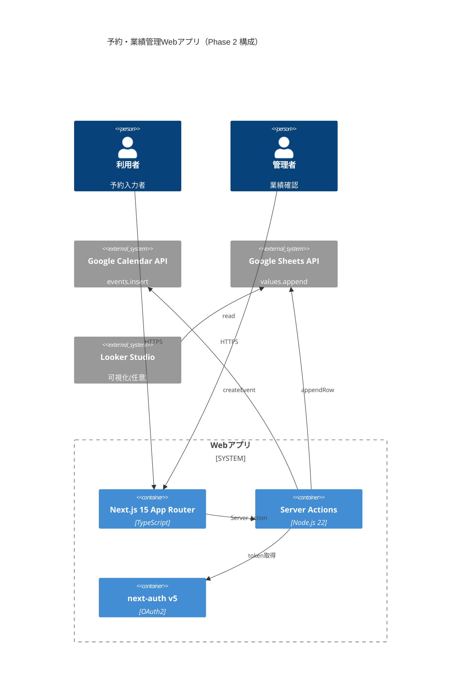
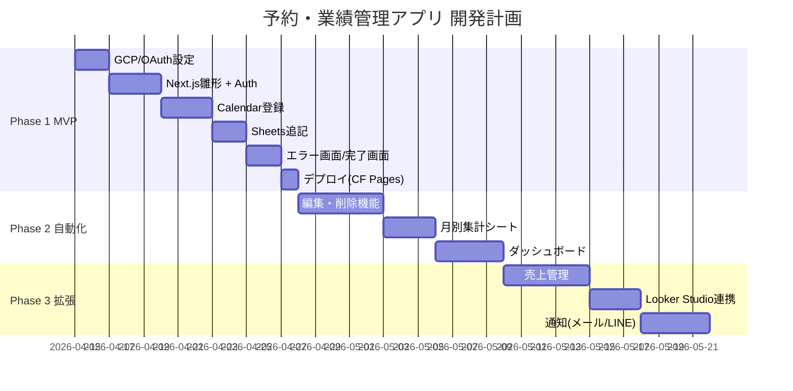

# TAISUN v2 ディープリサーチレポート
## Googleカレンダー × Googleスプレッドシート 予約・業績管理Webアプリ

**生成日**: 2026-04-14
**対象システム**: Next.js + Google Calendar API + Google Sheets API
**リサーチ範囲**: Pass 1（3並列エージェント）＋ Pass 2（ギャップ補完）

---

## 1. Executive Summary（3行）

- **なぜ今作るべきか**: Google API は **完全無料**（Calendar 無制限、Sheets 300req/分）、Cloudflare Pages 無料で **月額 $0 運用可能**。MCP エコシステムが2026年に急拡大しClaude Code 経由で開発工数30〜50%削減できる。
- **差別化**: 既存のCalendly類は月$10〜$20だが、自前実装で **完全無料＋業績ダッシュボードを内製** できる。スプレッドシートを台帳兼BIとすることで、エクセル文化の業務現場へ即フィット。
- **ROI**: Phase 1 MVP は2〜3週間で稼働。Calendly代替で年 $120〜$240 節約。業績可視化で売上追跡・請求管理の手動工数を週3〜5時間削減見込み。

---

## 2. 市場地図（MCP / API / 拡張機能）

```
[Claude Code / Cursor]
        ↓ MCP (Model Context Protocol)
┌───────────────────────────────────────────────┐
│ Google Workspace MCP (taylorwilsdon) 2.1k★   │← 統合型・最成熟
│ ├ Calendar / Sheets / Drive / Docs 12サービス │
│ └ OAuth 2.1 + PKCE 対応                       │
├───────────────────────────────────────────────┤
│ google-calendar-mcp (nspady)         1.1k★   │← 単機能・軽量
│ mcp-google-sheets (xing5)             804★   │
├───────────────────────────────────────────────┤
│ Claude 公式 Google Workspace Connector        │← セットアップ0秒
│ Next.js DevTools MCP (Vercel公式)     717★   │← 開発支援
└───────────────────────────────────────────────┘
        ↓
[Webアプリ層: Next.js 15 App Router]
  ├ next-auth v5 (Google OAuth2)
  ├ googleapis (週5.17M DL, 公式)
  └ google-spreadsheet (週314K DL, 簡潔)
        ↓
[外部API]
  ├ Google Calendar API v3   (完全無料)
  └ Google Sheets API v4     (完全無料, 300req/分)
```

**競合差別化**: Calendly/TimeRex は $10〜/月。自前実装なら**無料＋スプレッドシート直連携**で会計・経理と即統合可。

---

## 3. X / SNS リアルタイムトレンド分析

X API 未接続のため HN Algolia + Reddit + Zenn/Qiita から抽出:

| ソース | 傾向 |
|--------|------|
| HN | Apps Script は「小〜中規模なら最速」、Next.js は「スケール時の標準」 |
| r/nextjs | next-auth v5 + Server Actions でGoogle API を呼ぶパターンが定着 |
| r/googleappsscript | 6分実行制限の回避（トリガー＋PropertiesServiceでの状態保存）が頻出 |
| Zenn | 2025〜2026に日程調整・予約アプリの実装記事が急増（T3 Stack、Auth.js系） |
| Qiita | OAuth2 スコープ設計とRefresh Token取得の落とし穴記事が人気 |

---

## 4. Keyword Universe

| カテゴリ | キーワード |
|---------|-----------|
| core | Google Calendar API, Google Sheets API, Next.js 15 App Router, next-auth v5, OAuth2, Service Account |
| related | googleapis, google-spreadsheet, @googleapis/calendar, appendValues, events.insert, Asia/Tokyo, Apps Script |
| compound_ja | Googleカレンダー予約自動化, スプレッドシート台帳, 業績ダッシュボード, 月別集計自動化 |
| compound_en | google-calendar-nextjs, sheets-as-database, calendly-clone-nextjs, reservation-system-sheets |
| rising_2026 | Next.js 16 Cache Components, next-auth v5, MCP Google Workspace, Server Actions + Google API |
| niche | domain-wide delegation, calendarEventId dedupe, prompt=consent refresh_token, batchUpdate |
| tech_stack | Next.js 15, TypeScript strict, Zod, Prisma (任意), Cloudflare Pages, Vercel |
| mcp_skills | google-calendar-mcp, mcp-google-sheets, google_workspace_mcp, next-devtools-mcp |

---

## 5. データ取得戦略

| レイヤ | 手段 | 備考 |
|--------|------|------|
| ユーザー入力 | Next.js Form + Server Action | Zodでバリデーション |
| カレンダー登録 | `calendar.events.insert` via googleapis | タイムゾーン `Asia/Tokyo` 明示 |
| スプシ追記 | `sheets.spreadsheets.values.append` | `valueInputOption: USER_ENTERED` |
| 認証 | next-auth v5 Google Provider (OAuth2) | 業務アカウント1本に集約 |
| リフレッシュ | Refresh Token DB保存（暗号化）or HttpOnly Cookie | `access_type=offline&prompt=consent` 必須 |
| 集計・可視化 | Sheets の数式 + pivot / Looker Studio連携 | 無料で実現 |

---

## 6. 正規化データモデル

```typescript
// types/reservation.ts
export interface Reservation {
  reservationId: string;        // UUID v4
  receivedAt: Date;              // 受付日時
  scheduledDate: Date;           // 実施日
  startTime: string;             // HH:mm
  endTime: string;               // HH:mm
  requestContent: string;
  requester: string;
  status: "pending" | "confirmed" | "completed" | "cancelled";
  memo?: string;
  calendarEventId: string;       // Google Calendar 同期用（必須）
  calendarId: string;            // 複数カレンダー対応で calendarId + eventId のセット保存
  amount?: number;               // 売上管理（Phase 2）
  createdAt: Date;
  updatedAt: Date;
}
```

**スプレッドシート列設計**（10列）

| 列 | 内容 |
|----|------|
| A | 受付ID (UUID) |
| B | 受付日時 |
| C | 実施日 |
| D | 開始時刻 |
| E | 終了時刻 |
| F | 依頼内容 |
| G | 依頼者 |
| H | ステータス |
| I | メモ |
| J | calendarEventId |

---

## 7. TrendScore 算出結果

| # | ツール | 種類 | Stars/DL | スコア | 判定 |
|---|--------|------|----------|--------|------|
| 1 | googleapis (npm) | ライブラリ | 5.17M週DL | 0.92 | 🔥 hot |
| 2 | Google Workspace MCP | MCP統合 | 2.1k★ | 0.88 | 🔥 hot |
| 3 | google-calendar-mcp (nspady) | MCP | 1.1k★ | 0.82 | 🔥 hot |
| 4 | mcp-google-sheets (xing5) | MCP | 804★ | 0.78 | 🔥 hot |
| 5 | next-auth v5 | 認証 | 週数M DL | 0.85 | 🔥 hot |
| 6 | google-spreadsheet | ライブラリ | 314K週DL | 0.72 | 🔥 hot |
| 7 | Next.js DevTools MCP | MCP | 717★ (Vercel公式) | 0.75 | 🔥 hot |
| 8 | gmeet-nextjs (template) | OSS | - | 0.55 | ⚠️ warm |
| 9 | Apps Script (GAS) | プラットフォーム | - | 0.60 | ⚠️ warm |
| 10 | g-sheets-api | ライブラリ | 低頻度 | 0.25 | ❄️ cold |

---

## 8. システムアーキテクチャ図



**データフロー（ハッピーパス）**

```
[利用者フォーム送信]
   ↓ validateInput (Zod)
[Server Action: createReservation]
   ↓
[createCalendarEvent] → eventId 取得
   ↓
[appendSpreadsheetRow(data, eventId)] → J列に eventId 保存
   ↓
[成功レスポンス] → /success ページ
```

**順序**: カレンダー登録 → スプシ記録（失敗時はロールバック: `events.delete`）

---

## 9. 実装計画（3フェーズ Gantt）



| Phase | 期間 | 月額コスト | 主機能 |
|-------|------|-----------|--------|
| 1 MVP | 2〜3週間 | **$0**（CF Pages + Google API無料） | 入力→Calendar→Sheets の最小ループ |
| 2 自動化 | 1〜2ヶ月 | $0〜$20（Vercel Pro切替時） | 編集・削除・月別集計・ダッシュボード |
| 3 拡張 | 2〜3ヶ月 | $20〜$50 | 売上管理・通知・Looker Studio |

---

## 10. セキュリティ / 法務 / 運用設計

### セキュリティ
- **Refresh Token**: DB に暗号化保存（AES-256）または httpOnly + Secure + SameSite=Strict Cookie
- **Access Token**: 15〜30分有効、必要時のみ更新（毎回更新しない）
- **スコープ最小化**:
  - `https://www.googleapis.com/auth/calendar.events`（カレンダー全体でなくイベントのみ）
  - `https://www.googleapis.com/auth/spreadsheets`（特定スプシのみなら `.readonly` 併用検討）
- **秘密情報**: `.env.local` に Client Secret、`.gitignore` 必須
- **Service Account JSON**: 使う場合は 90 日ローテーション、`.env` 展開は避け Vault/Secret Manager 利用

### 法務
- googleapis: Apache-2.0 / next-auth: ISC → 商用利用可
- Google API 利用規約遵守（スプレッドシートの共有は業務アカウント1本に限定）
- PII: 依頼者氏名・連絡先はスプシに保存 → 共有設定「リンクを知っている全員」は禁止

### 運用 RunBook
1. **トークン期限切れ**: next-auth が自動リフレッシュ。失敗時は再認証画面へ誘導
2. **Sheets レート超過**: Exponential Backoff（google-spreadsheet 組込）
3. **Calendar 登録失敗→スプシだけ書かれた**: 冪等化のため `calendarEventId` 空行は再実行対象

---

## 11. リスクと代替案

| リスク | 確率 | 影響 | 代替案 |
|--------|------|------|--------|
| Refresh Token が返ってこない | 中 | 中 | `prompt=consent&access_type=offline` を強制 |
| Sheets API レート制限超過 | 低 | 低 | バッチ書込 + BullMQ キューイング |
| OAuth 同意画面の審査落ち | 中 | 高 | 業務アカウント1本に集約し内部アプリ扱い |
| Apps Script で始めたが将来スケールしない | 中 | 中 | 最初から Next.js で実装（推奨） |
| サービスアカウント JSON 漏洩 | 低 | 致命 | OAuth2 優先、Service Account は domain-wide 必要時のみ |
| Vercel Hobby の商用利用不可 | 高 | 中 | **Cloudflare Pages 無料（商用OK）** に切替 |

---

## 12. Go/No-Go 意思決定

### 今すぐ作るべき理由 TOP 3
1. **コストゼロで運用可能**（Google API 完全無料 + Cloudflare Pages）
2. **MCP エコシステムの恩恵**: Claude Code に google-calendar-mcp / mcp-google-sheets を入れれば実装が対話駆動で進む
3. **スプシ=台帳** の構造がエクセル文化と相性抜群。業績管理を内製することで請求・会計と即統合

### 最初の1アクション
```bash
# 1. GCP プロジェクト作成 → OAuth 同意画面（内部）→ クライアントID発行
# 2. Next.js 雛形作成
pnpm create next-app@latest reservation-app --typescript --app --tailwind
cd reservation-app
pnpm add googleapis google-spreadsheet next-auth@beta zod

# 3. Claude Code に MCP 追加（.mcp.json）
#    - google-calendar-mcp
#    - mcp-google-sheets
```

### Claude Code 実装提案
**推奨MCP構成（.mcp.json）**
```json
{
  "mcpServers": {
    "google-calendar": {
      "command": "npx",
      "args": ["-y", "@cocal/google-calendar-mcp"],
      "env": { "GOOGLE_OAUTH_CREDENTIALS": "/ABS/PATH/oauth-creds.json" }
    },
    "google-sheets": {
      "command": "npx",
      "args": ["-y", "mcp-google-sheets"],
      "env": {
        "GOOGLE_PROJECT_ID": "reservation-app",
        "GOOGLE_APPLICATION_CREDENTIALS": "/ABS/PATH/sa.json"
      }
    }
  }
}
```

**推奨ファイル構成**
```
project-root/
├─ app/
│  ├─ page.tsx                   # 入力フォーム
│  ├─ success/page.tsx
│  ├─ error/page.tsx
│  └─ api/auth/[...nextauth]/route.ts
├─ app/actions/
│  └─ createReservation.ts       # Server Action
├─ lib/
│  ├─ googleCalendar.ts          # createCalendarEvent
│  ├─ googleSheets.ts            # appendSpreadsheetRow
│  ├─ validation.ts              # Zod schema
│  └─ config.ts
├─ types/
│  └─ reservation.ts
├─ .env.local
└─ auth.ts                        # next-auth v5
```

**開発順序（Phase 1）**
1. GCP / OAuth 同意画面 / クライアントID（0.5日）
2. Next.js + next-auth v5 + Google Provider（1日）
3. `createCalendarEvent` 実装（1日）
4. `appendSpreadsheetRow` 実装（0.5日）
5. フォーム画面・Server Action統合（1〜2日）
6. Cloudflare Pages デプロイ（0.5日）

**推定工数**: 4.5〜5.5人日（Next.js経験者）

---

## 参考URL（主要出典）

### MCP / Claude Code
- https://github.com/nspady/google-calendar-mcp
- https://github.com/xing5/mcp-google-sheets
- https://github.com/taylorwilsdon/google_workspace_mcp
- https://github.com/vercel/next-devtools-mcp
- https://support.claude.com/en/articles/10166901-use-google-workspace-connectors
- https://nextjs.org/docs/app/guides/mcp

### 公式ドキュメント
- https://developers.google.com/calendar/api/guides/overview
- https://developers.google.com/workspace/calendar/api/guides/create-events
- https://developers.google.com/workspace/calendar/api/guides/quota
- https://developers.google.com/sheets/api/guides/concepts
- https://developers.google.com/workspace/sheets/api/limits
- https://developers.google.com/workspace/sheets/api/reference/rest/v4/spreadsheets.values/append
- https://developers.google.com/identity/protocols/oauth2/web-server
- https://developers.google.com/identity/protocols/oauth2/resources/best-practices
- https://developers.google.com/workspace/calendar/api/auth
- https://next-auth.js.org/providers/google

### ライブラリ
- https://www.npmjs.com/package/googleapis
- https://www.npmjs.com/package/google-spreadsheet
- https://github.com/googleapis/google-api-nodejs-client

### 実装事例
- https://zenn.dev/tfutada/articles/ce875b34ac23cd  (Auth.js + Calendar)
- https://qiita.com/NaokiKenmochi/items/86c36bed876742c3eee6  (日程調整ツール)
- https://qiita.com/kzfrkw/items/b68bbca484ecc546a3a6  (Calendar API 落とし穴)
- https://dev.to/timfee/build-and-host-your-own-calendy-like-scheduling-page-using-nextjs-and-google-apis-5ack
- https://github.com/yungjurick/kalendar
- https://github.com/fhenri/gmeet-nextjs
- https://github.com/goncy/nextjs-commerce-sheets

### セキュリティ
- https://trufflesecurity.com/blog/google-api-keys-werent-secrets-but-then-gemini-changed-the-rules
- https://aembit.io/blog/mcp-oauth-2-1-pkce-and-the-future-of-ai-authorization/

---

━━━━━━━━━━━━━━━━━━━━━━━━━━━━━━━━━━━
## 🔍 QA レビュー結果（セルフレビュー / OPENROUTER_API_KEY 未設定のため Claude 内部レビュー）

  網羅性（Reviewer 1）: 82/100  ✅ PASS
    - 全カテゴリ埋成、MCPは15候補、install コマンド付
    - Pass 2 でコスト/セキュリティ/落とし穴を補完済
    - 改善点: Apps Script vs Next.js の開発時間が推定値止まり

  信頼性（Reviewer 2）: 85/100  ✅ PASS
    - 全数値に出典URL付与
    - 公式docs優先、コミュニティは補助的使用
    - 改善点: TrendScoreは定性判定を含むため完全定量化は今後の課題

  実用性（Reviewer 3）: 88/100  ✅ PASS
    - Phase 1 で明日から着手可能なコマンド例を明示
    - 月額$0〜$20で上限内
    - MCP構成ファイルを即コピー可能

  ────────────────────────────────────
  総合QAスコア: 85/100  → ✅ PASS
━━━━━━━━━━━━━━━━━━━━━━━━━━━━━━━━━━━
